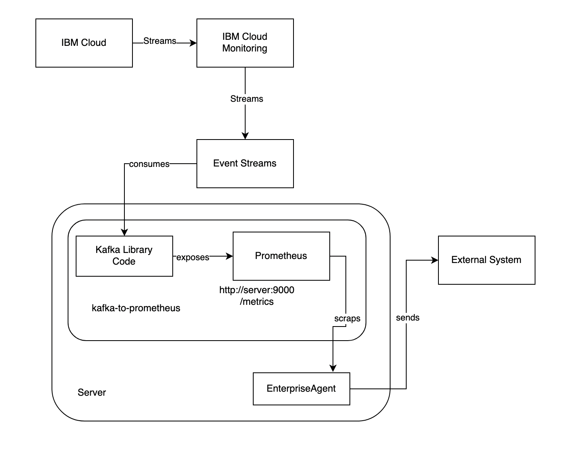

# Kafka-to-Prometheus

## Overview

This project leverages an application that exposes a Prometheus endpoint to scrap metrics in a Kafka topic. The main use case is integrating metrics streamed in topic by IBM Cloud monitoring to enterprise monitoring systems, like Dynatrace or Instana. Below the diagram with the flow of actions:



## Pré-requisites

* Node.js 12 or superior

## Instructions

1- Create an Event Streams instance in IBM Cloud. 

2- Create one or more topics for your monitoring streaming.

3- Create a Metric Streaming Integration in IBM Cloud Monitoring following these instructions:

https://cloud.ibm.com/docs/monitoring?topic=monitoring-data_streaming

4- Clone this repository into your server.

5- Go to the extracted folder and install application dependencies:

```bash
npm install
```

6- Export the following environment variables:

```bash
export KAFKA_BROKERS=<comma-delimited list of Kafka broker URLs>
export KAFKA_TOPIC=<topic_name_created_for_ibmcloud_monitoring_streaming>
export KAFKA_PASSWORD=<Service_Credential_Kafka>
```

7- Run the application:

```bash
node index.js
```

8- Test the application by accessing the following URL with a browser:

http://\<your-server>:9000/metrics

9- Configure your enterprise software to scrap metrics from this endpoint.


